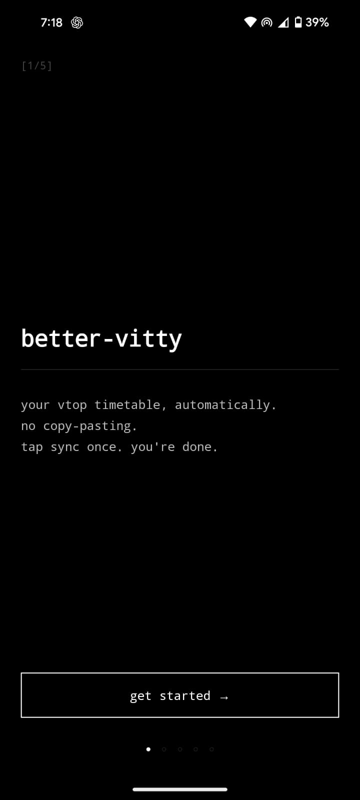
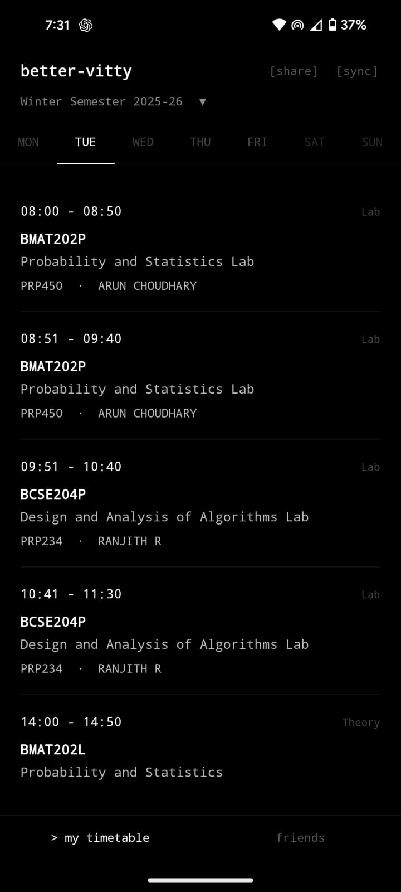
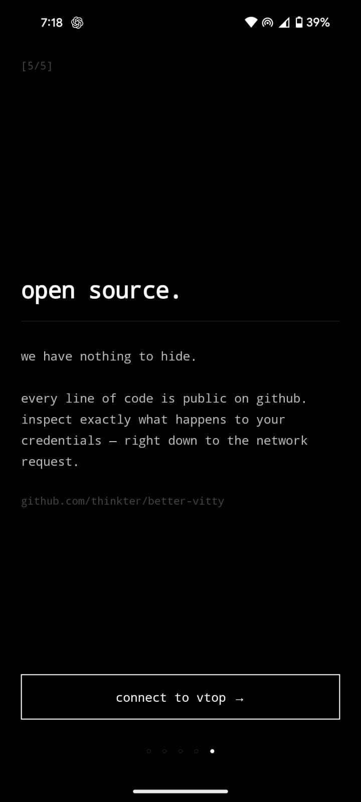

# better-vitty

your vit timetable on your phone.

---

[vitty](https://github.com/GDGVIT/vitty-app) already exists and it's great. but it's [centralized](https://github.com/GDGVIT/vitty-backend)  your timetable lives on their servers and the onboarding is a pain. Google OAuth, manual timetable upload, the whole thing.

better-vitty does it differently: it logs into VTOP directly from your phone, pulls your timetable, and saves it locally. that's it. nothing goes anywhere. no accounts, no servers, no middlemen.

enter your VTOP credentials once. every sync after that is automatic. new semester, dropped a course, added an elective, just tap sync and it picks it up.

<p align="center">
  
  &nbsp;&nbsp;
  
  &nbsp;&nbsp;
  
</p>

## features 

- pulls your timetable straight from VTOP
- stores everything on-device (credentials go into Android's secure storage)
- home screen widget showing today's classes
- share your timetable as a QR code, friends can scan it in-app or import from gallery
- friends tab for keeping a bunch of saved timetables
- auto-handles new semesters and course changes

## what it doesn't do

- phone home
- collect anything
- require an account
- exist on the Play Store

it's not on the Play Store on purpose. feel free to build it on you own and share it with your friends, feel free to modify it :D

## building it

you'll need Node.js, pnpm, and Android Studio (for the SDK and a connected device or emulator).

```sh
git clone https://github.com/thinkter/better-vitty
cd better-vitty
pnpm install
```

**debug build** (fastest way to get it running):

```sh
pnpm android
```

**release APK** (what you'd actually share):

```sh
cd android
./gradlew assembleRelease
```

the APK lands at `android/app/build/outputs/apk/release/app-release.apk`. send it to whoever.

if you want a signed APK (so Android doesn't complain about installing from unknown sources on every update), you'll need to set up a keystore. the [Android docs](https://developer.android.com/studio/publish/app-signing) cover it, or you can just resign each time, for sharing with a handful of people it doesn't really matter.

## running tests

```sh
pnpm test
pnpm typecheck
```

## project structure

```
src/
  vtop/       VTOP client, login, timetable fetching
  screens/    top-level screens
  components/ UI components
  storage/    local persistence (SQLite + secure store)
  lib/        shared types and utilities
packages/
  captcha-solver/  solves the VTOP login captcha locally
```

the app talks directly to vtop.vit.ac.in. no proxy layer. you can verify this by reading `src/vtop/client.ts`, it's a straightforward fetch wrapper with cookie handling.

## contributing

open an issue or send a PR. the main things that could use work are iOS support and making the timetable parsing more resilient when VTOP inevitably changes its HTML again.

## license

MIT
